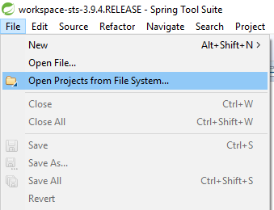

# Download the initial project

When developing a Spring application a great place to start is with the [Spring Initializr](https://start.spring.io) tool. The website will allow you to select from a few simple settings and choose different libraries to include to help you get started with a skeleton Spring application that's ready to go!

Go ahead and navigate to the [Spring Initializr](https://start.spring.io) tool and switch your view to the full version. 


Scrolling down we can start to see a number of libraries that Spring can automatically include with your download when selected. We're using a very simple application that won't need to include any additional libraries, but it might be worthwhile to read up on ones that interest you. Keep all of the default settings and click the `Generate Project` button to generate a zip file that contains our fully set up application. All that's left is to navigate to the download location and begin unzipping the file. 

>**NOTE:** We already have a Spring project set up in this environment that we're going to be using for display purposes, but make sure to follow along and download the application locally as well.

Now that we have our project downloaded let's load it into an IDE for further modification. Since we're using a Spring application we're going to be using `Spring Tool Suite`(STS) for our IDE, which is an Eclipse-based development environment that's been customized specifically for Spring application development. You can download STS [here](https://spring.io/tools/sts/all) and can read about some of the benefits and features [here](https://spring.io/tools/sts).

After installing STS we need to load up our Spring Initializr project. Click `File` and `Open Projects from File System...`.



From there simply click the `Directory...` button and navigate to the downloaded project folder. Click `Finish` and STS will load the project for you. If everything went successfully, we should end up with a file structure that looks like this:


```sh
.
├── pom.xml
└── src
    └── main
       ├── java
       │   └── com
       │       └── example
       │                └──DemoApplication.java
       │           
       └── resources
            ├── application.properties
            └── templates
```


after download, tell thim to hit tree and it will look just like this: (tree)
If you want to follow along locally, you can download the project and run any commands done in here on your personal machine.
Mention differences of pom
test
verify

END


One thing that differs slightly is the ``pom.xml``{{open}} file.

As you review the content, you will notice that there are a couple **TODO** comments. **Do not remove them!** These comments are used as markers for later exercises in this scenario. 

Notice that we are not using the default BOM (Bill of material) that Spring Boot projects typically use. We are using a BOM provided by Red Hat as part of the [Snowdrop](http://snowdrop.me/) project instead. We use this BOM to make sure that we are using only the dependency versions supported by Red Hat.

```xml
  <dependencyManagement>
    <dependencies>
      <dependency>
        <groupId>me.snowdrop</groupId>
        <artifactId>spring-boot-bom</artifactId>
        <version>${spring-boot.bom.version}</version>
        <type>pom</type>
        <scope>import</scope>
      </dependency>
    </dependencies>
  </dependencyManagement>
```

**1. Adding Spring Boot Web to the application**

Since our application will be a web application we need to use a servlet container like Apache Tomcat or Undertow to handle incoming connections from clients. Since Red Hat offers support for Apache Tomcat (e.g., security patches, bug fixes, etc.) we will use it here. 

>**NOTE:** Undertow is another an open source project that is maintained by Red Hat and therefore Red Hat plans to add support for Undertow shortly.

To add these dependencies to our project, add the following lines in the ``pom.xml``{{open}} (If you left the TODO comments in you can click the `Copy to Editor` button to do this automatically)

<pre class="file" data-filename="pom.xml" data-target="insert" data-marker="<!-- TODO: Add web dependencies here -->">
&lt;dependency&gt;
    &lt;groupId&gt;org.springframework.boot&lt;/groupId&gt;
    &lt;artifactId&gt;spring-boot-starter-web&lt;/artifactId&gt;
&lt;/dependency&gt;
</pre>

There are other dependencies brought in by this Spring Starter POM. For this scenario we are mostly focusing on bringing in the necessities for a simple web page. We will dive into this dependency in more detail in the next couple modules.

You may notice that there is no `<version>` tag here. That's because the version numbers are managed and automatically derived by the BOM we included earlier. 

**2. Test the application locally**

As we develop the application we want to be able to test and verify our change at different stages. One way we can do that locally is by using the `spring-boot` maven plugin.

Run the application by executing the following command:

``mvn spring-boot:run``{{execute}}

>**NOTE:** The Katacoda terminal window is like your local terminal. Everything that you run here you should be able to execute on your local computer as long as you have `Java SDK 1.8` and `Maven` installed. In later steps, we will also use the `oc` command line tool for OpenShift commands.

**3. Verify the application**

To begin with click on the **Local Web Browser** tab in the console frame of this browser window which will open another tab or window of your browser pointing to port 8080 on your client. Or use [this](https://[[HOST_SUBDOMAIN]]-8080-[[KATACODA_HOST]].environments.katacoda.com/) link.

You should now see an HTML page with the `Welcome to Spring Boot` welcome message. If you see this then you've successfully set up the application! If not check the logs in the terminal. Spring Boot adds a couple helper layers to catch common errors and print helpful messages to the console so check for those first.

**4. Stop the application**

Before moving on, click in the terminal window and then press **CTRL-C** to stop the running application!

## Congratulations

You have now successfully executed the first step in this scenario. In the next step we will load the project into an IDE so we can further modify our application. This example is extremely simple as it is meant to only introduce you to Spring Boot and RHOAR.
