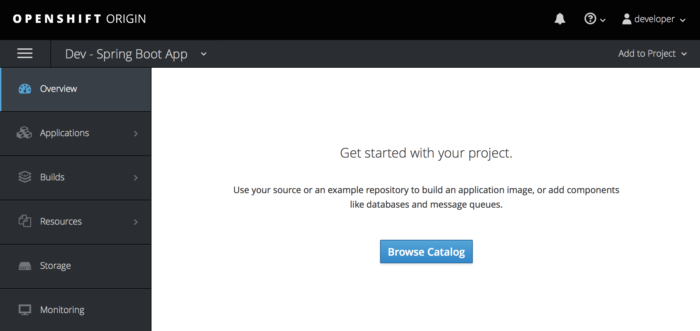

# Load the project into STS

**Red Hat OpenShift Container Platform** is the preferred runtime for **Red Hat OpenShift Application Runtimes** like **Spring Boot**, **Vert.x**, etc. The OpenShift Container Platform is based on **Kubernetes** which is a Container Orchestrator that has grown in popularity and adoption over the last couple years. **OpenShift** is currently the only container platform based on Kuberenetes that offers multitenancy. This means that developers can have their own personal, isolated projects to test and verify applications before committing to a shared code repository.

OpenShift also ships with a feature rich web console as well as command line tools to provide users with a friendly interface to work with applications deployed to the platform. 

**1. Login to the OpenShift Container Platform**

To login, we will use the `oc` command and then specify a username and password like this:

``oc login [[HOST_SUBDOMAIN]]-8443-[[KATACODA_HOST]].environments.katacoda.com --insecure-skip-tls-verify=true -u developer -p developer``{{execute}}

>**IMPORTANT:** If the above `oc login` command doesn't seem to do anything, you may have forgotten to stop the application from the previous step. Click on the terminal and press **CTRL-C** to stop the application and try the above `oc login` command again!

**2. Create a Project**

[Projects](https://docs.openshift.com/container-platform/3.6/architecture/core_concepts/projects_and_users.html#projects) are a top-level concept to help you organize your deployments. An OpenShift project allows a community of users (or a user) to organize and manage their content in isolation from other communities. Each project has its own resources, policies (who can or cannot perform actions), and constraints (quotas and limits on resources, etc.). Projects act as a wrapper around all the application services and endpoints you (or your teams) are using for your work.

For this scenario let's create a project that you will use to house your application. 

``oc new-project dev --display-name="Dev - Spring Boot App"``{{execute}}

**3. Open the OpenShift Web Console**

OpenShift ships with a web-based console that will allow users to
perform various tasks via a browser. To get a feel for how the web console
works, click on the "OpenShift Console" tab next to the "Local Web Browser" tab. The login credentials are the ones used in the `oc login` command: developer/developer.

The first screen you will see is the authentication screen. Enter the developer username and password used before and 
then login:

After you have authenticated to the web console you will be presented with a list of projects that your user has permission to view.

Click on your new project to be taken to the project overview page which will list all of the routes, services, deployments, and pods that you have created as part of your project:

There's nothing there now, but that's about to change.

## Congratulations

You have now learned how to access your OpenShift environment. In next step we will deploy our application to the OpenShift Container Platform.