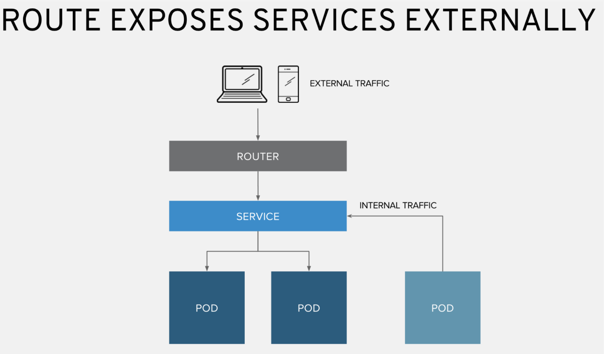
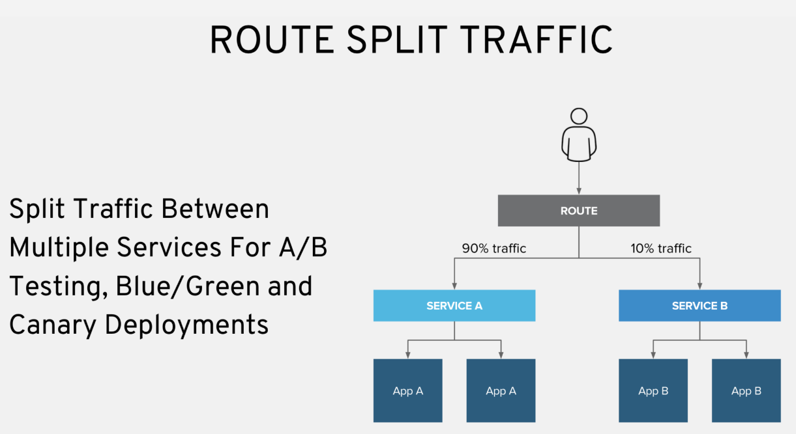

# Load Balancing

As its name suggests, Load Balancing is the process of balancing the amount of traffic that a system receives by spreading it across multiple resources. It's a useful process that has multiple applications and benefits that we'll take a look at.

**1. Why use Load Balancing?**

As we mentioned, the act of load balancing is done with a Load Balancer and evenly spreads traffic to multiple resources. However the only use of a Load Balancer doesn't have to be for pure efficiency reasons. Because all we're really doing is directing traffic, nothing stops us from directing traffic to specific resources over others for reasons other than balancing traffic.

**1.1 A/B Testing**

`A/B testing` is a prime example of functionality that we can achieve through load balancing that isn't directly related to performance. A/B testing is the process of having two slightly different versions of the same application and deploying both. Maybe the first version has a button that we want our users to click on in the top left corner while the second version put the same button in the top right. With Load Balancing we can direct some amount of our traffic to both scenarios and see which ones illicit the desired response from our users. 

In that simple example there may be no reason to filter which users see which outcome so we might pick the participants randomly. However if we wish to make a change be visible to only a smaller subset of our users, let's say all users that are visiting our application from outside of the United States, this is also possible. This is a powerful concept that can be used to continually improve an application through monitoring and measuring small changes made in a production environment with actual users.

**1.2 Blue/Green Deployment**

On top of testing, we can also use Load Balancing to help implement different deployment strategies that give us some advantages. One of those is the `Blue/Green Deployment` strategy. The idea behind Blue/Green deployment is to have two deployment environments that we swap between. When we start the process, both regions have the exact same code but only one is the `live` region. The region that isn't live is the `backup` region for now. Once a new version comes out we push those changes to our backup region. This now becomes the `staging` region for our new version. Once we determine that our new version is stable, we reallocate all of the traffic that was going to our previous live region to go to our new staging region. Our `staging` region becomes our `live` region, and our `live` region becomes our `backup` region.

One of the major benefits to this deployment strategy is that it's very quick and easy to revert to a previous version. All it takes is diverting the traffic to the region that's deployed but not in use. Blue/Green deployment also minimizes downtime since our application is never taken fully down, the traffic is only being directed to our new regions. You can read more about `Blue/Green Deployment` [here](https://martinfowler.com/bliki/BlueGreenDeployment.html).

**1.3 Canary Deployment**

Another example of a deployment strategy that Load Balancing let's us take advantage of is the `Canary Deploment` strategy. Also known as `Phased Rollout` or `Incremental Rollout`, this concept is a simple one. The idea is that we have some new version of our application that we want to release to production. Because we can't guarantee the stability of our new application version we don't want to expose it to all of our users at once. In an attempt to see how stable our new version is, we instead incrementally rollout our new version to a small group of users at a time. 

Since we're choosing which users are being exposed to the new version of the application we can closely monitor any unintended side-effects that might arise from the new version. This greatly reduces the impact of a serious outage affecting all users since we're able to get a small group of users to test the new version directly without impacting all users with the hope that any issues will become evident from the sample size selected. You can read more about `Canary Deployment` [here](https://martinfowler.com/bliki/CanaryRelease.html).

**2. How Load Balancing is handled in OpenShift**

Load Balancing functionality is built into OpenShift by default. OpenShift provides its load balancing through its concept of service abstraction. All incoming traffic first comes through a Router, which is responsible for exposing the service externally for users.

 The Router will then split the traffic on to the different services that have been requested. It's the service that defines how it's distributed, but since the router is the one splitting the traffic you get to decide how to split which traffic goes to which of the multiple service instances.

You can read more about Load Balancing [here](https://access.redhat.com/documentation/en-us/reference_architectures/2017/html-single/spring_boot_microservices_on_red_hat_openshift_container_platform_3/index#load_balancer).

## Congratulations

Now that we've gone over what Load Balancing is and common use cases, our next step will take a look into another topic that comes up often when discussing microservices, and that's `Service Discovery`.
