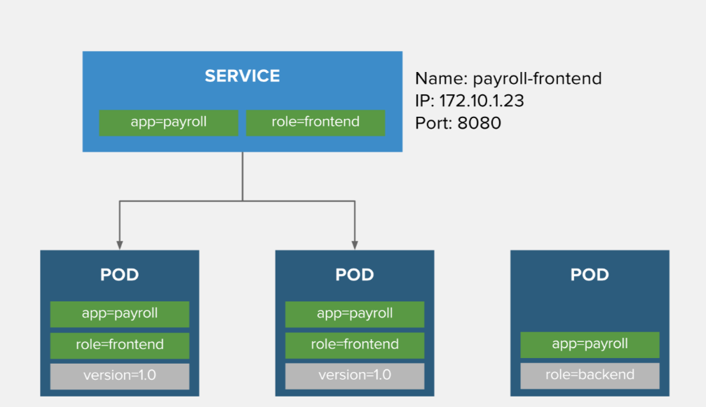

# Service Discovery

When we're handling a microservice architecture, it's very possible that we have multiple services across multiple servers or even multiple data servers. While the end user might not care much about the location of any of these services, our application is highly concerned with the connection details for each service. This problem is addressed with `Service Discovery`.

**1. What is Service Discovery?**

As we mentioned, when services become spread out they become difficult to manage. It's tough to keep track of where each service is and what information details are needed to connect to each service. Service Discovery is exactly what it sounds like, the process of discovering all of our exposed services and how to connect with them.

This process of keeping track of multiple services is solved with the use of a `Service Register`. Each service registers with the Service Register upon creation, and the Service Register is responsible for handling and maintaining the information required to connect to each service. 

You can read more about Service Discovery [here](https://appdev.openshift.io/docs/spring-boot-runtime.html#creating-a-basic-spring-boot-application_spring-boot).

**2. How Service Discovery is handled in OpenShift**

Service Discovery is functionality built into OpenShift by default through the use of Kubernetes services. When we are deploying our microservices, we are creating multiple pods that are all assigned to one service that acts like a parent. This assignment happens by creating a `Label` that's given to the pod, which the Service is told to look for through its `Service Selector`. The service will then grab any pod that's created and has the specified label. This means there's no work necessary on our side when we want to have an existing service handle newly created pods.

The service acts as an internal load balancer, proxying any requested connections to any of the pods using their internal IP addresses. While pods can be added or removed arbitrarily, the service remains consistently available. This allows anything that depends on the service to use a consistent internal address.

Since it's possible for microservices to go down from time to time, it's important to think of how that situation gets handled within the Service Register. Generally a service register is paired with a load balancer layer (mentioned in the previous section) that will seamlessly fail over upon discoving that the instance no longer exists. So if a service instance was to go down, the service register would not be able to return the required information and the load balancer would kick in to handle it while also caching the service registry lookups.

## Congratulations

We've now gone over two important core concepts when dealing with a microservice architecture and took a look at how OpenShift handles all of the heavy lifting for us in regards to Load Balancing and Service Discovery!
