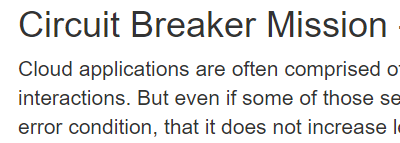

# Deploy to OpenShift and Test Application

**1. Login and create a Project**

To login, we will use the `oc` command and then specify a username and password like this:

``oc login -u developer -p developer``{{execute}}

Now we'll create a base project for our application:

``oc new-project dev --display-name="Dev - Spring Boot App"``{{execute}}

All tha'ts left is to run the following command to deploy the application to our newly created project in OpenShift:

``mvn package fabric8:deploy -Popenshift``{{execute}}

**2. Connection to the application**

Now that our application is deployed, navigate to our route in the OpenShift Web View or click [here](http://spring-boot-circuit-breaker-greeting-dev.[[HOST_SUBDOMAIN]]-80-[[KATACODA_HOST]].environments.katacoda.com/). We should see the following header, meaning everything was successful:



**3. Test current functionality**

Although our application has a nice web view, we're going to interact with it through our terminal for testing purposes. The first thing we have to do is call our greeting service.

``curl http://spring-boot-circuit-breaker-greeting-dev.[[HOST_SUBDOMAIN]]-80-[[KATACODA_HOST]].environments.katacoda.com/api/greeting``{{execute}}

 Since we should have no issue and our application is online we should get our normal response, which should look like this:
 
 ```json
 {"content":"Hello, World!"}
 ```

This means that everything is working and our circuit is open!

## Congratulations

You have now learned how to deploy a Spring Boot application to OpenShift Container Platform and we've tested our current application. In our next step, we will trip the Circuit breaker and see how the functionality changes.