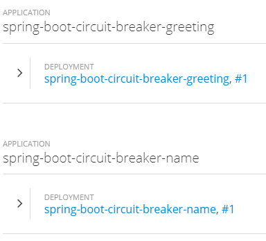
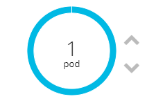
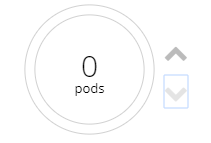

# Trip the Circuit Breaker

**1. Trip the Circuit Breaker**
Now that we know both of our services are online and everything is working, let's see what happens when we take down our Name service.

Pull up the web view and navigate to the Overview page. We should see both of our services here:



Expand the `spring-boot-circuit-breaker-name` service and we should see that we currently have 1 pod up:



Scale down our `spring-boot-circuit-breaker-name` service from 1 to 0, effectively taking down our service. We should get a warning about what we're about to do:



Now that our Name Service is down, let's see what happens when we repeat our previosu command:

``curl http://spring-boot-circuit-breaker-greeting-dev.[[HOST_SUBDOMAIN]]-80-[[KATACODA_HOST]].environments.katacoda.com/api/greeting``{{execute}}

Instead of seeing the name, our response should now look like this:

 ```json
 {"content":"Hello, Fallback!"}
 ```

Our Circuit Breaker has been tripped! Since the service went down we are no longer calling our Name service and we are instead returning the hardcoded test value that we created. No matter how many times we call our service, we should always expect that same response.

**2. Reset the Circuit Breaker**

Our application is now returning our failure value due to the closed circuit breaker. But now let's redeploy our Name service and see what happens.

Follow the previous steps to get to our Name Service, except this time scale *up* from 0 pods to 1.


After we confirm that our Name service is up and running on a pod, let's hit our greeting service again:

``curl http://spring-boot-circuit-breaker-greeting-dev.[[HOST_SUBDOMAIN]]-80-[[KATACODA_HOST]].environments.katacoda.com/api/greeting``{{execute}}

This time we should see our initial response again:

 ```json
 {"content":"Hello, World!"}
 ```

 Because our circuit breaker saw that the Name service was online again, it was able to change the circuit breaker's state back to `Open`. This means that we're able to get the proper response from the service again, as if we had never forced the circuit breaker to become `Closed` in the first place.

## Congratulations

You have now learned how a Circuit Breaker pattern can be used with communicating microservices, and how it will gracefully handle cascading failures through an application.