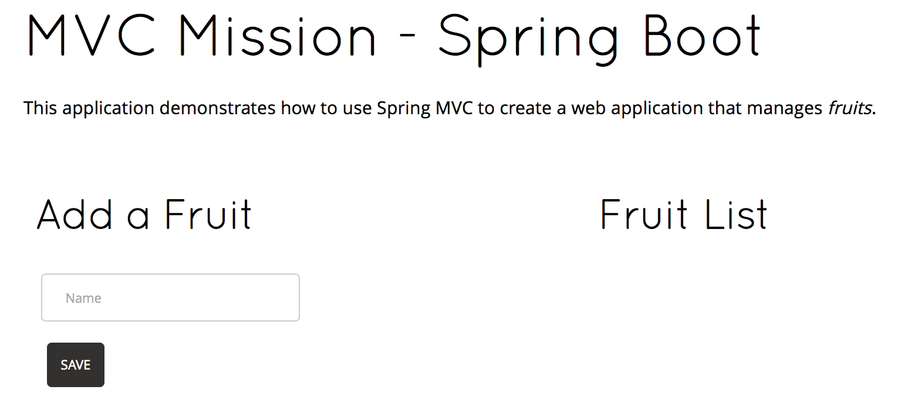

# Review the base structure of the application

For your convenience, this scenario has been created with a base project using the Java programming language and the Apache Maven build tool.

Initially the project is almost empty and doesn't do anything. Start by reviewing the base project's content by executing a ``tree``{{execute}} in your terminal.

The output should look something like this:

```sh
.
├── pom.xml
└── src
    └── main
       ├── fabric8
       │   ├── deployment.yml
       │   └── route.yml
       ├── java
       │   └── com
       │       └── example
       │                ├── Application.java
       │                └── service
       │                    └── HomeController.java
       │           
       └── resources
            ├──application-openshift.properties
            ├──application.properties
            └── templates
                └── home.html

```


Except for the `fabric8` directory, the `home.html`, and a few config files, this matches what you would get if you generated an empty project using the [Spring Initializr](https://start.spring.io). For the moment you can ignore the content of the fabric8 folder (we will discuss this later).

One thing that differs slightly is the ``pom.xml``{{open}} file.

As you review the content, you will notice that there are a couple **TODO** comments. **Do not remove them!** These comments are used as markers for later exercises in this scenario. 

Notice that we are not using the default BOM (Bill of material) that Spring Boot projects typically use. We are using a BOM provided by Red Hat as part of the [Snowdrop](http://snowdrop.me/) project instead. We use this BOM to make sure that we are using only the dependency versions supported by Red Hat.

```xml
  <dependencyManagement>
    <dependencies>
      <dependency>
        <groupId>me.snowdrop</groupId>
        <artifactId>spring-boot-bom</artifactId>
        <version>${spring-boot.bom.version}</version>
        <type>pom</type>
        <scope>import</scope>
      </dependency>
    </dependencies>
  </dependencyManagement>
```

**1. Test the application locally**

As we develop the application we want to be able to test and verify our change at different stages. One way we can do that locally is by using the `spring-boot` maven plugin.

Run the application by executing the following command:

``mvn spring-boot:run``{{execute}}

>**NOTE:** The Katacoda terminal window is like your local terminal. Everything that you run here you should be able to execute on your local computer as long as you have `Java SDK 1.8` and `Maven` installed. In later steps, we will also use the `oc` command line tool for OpenShift commands.

**3. Verify the application**

To begin with click on the **Local Web Browser** tab in the console frame of this browser window which will open another tab or window of your browser pointing to port 8080 on your client. Or use [this](https://[[HOST_SUBDOMAIN]]-8080-[[KATACODA_HOST]].environments.katacoda.com/) link.

You should now see an HTML page with a `Success` welcome message that looks like this:



If you see this then you've successfully set up the application! If not check the logs in the terminal. Spring Boot adds a couple helper layers to catch common errors and print helpful messages to the console so check for those first.

**4. Stop the application**

Before moving on, click in the terminal window and then press **CTRL-C** to stop the running application!

## Congratulations

You have now successfully executed the first step in this scenario. In the next step we will login to OpenShift and create a new project.
