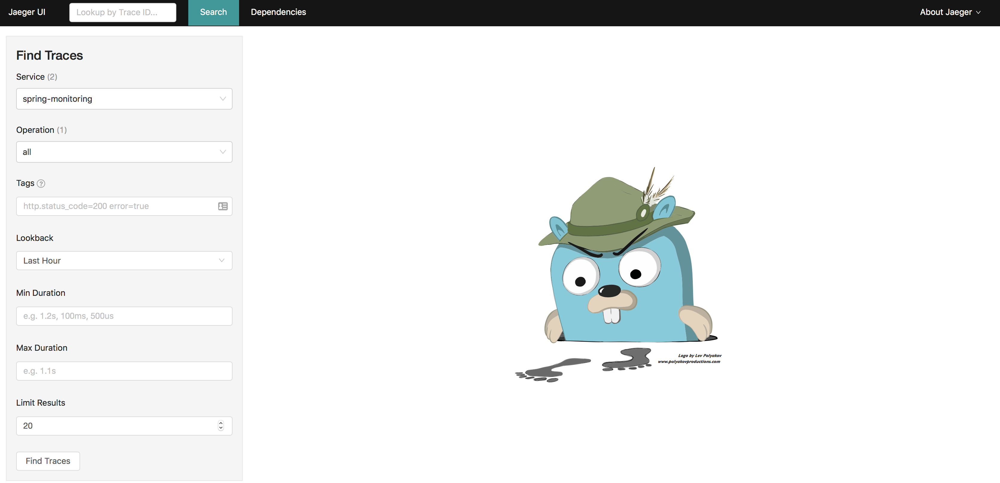

# Additional Monitoring

Our health check is nice to determine if our application is online and healthy but it would be nice if we had some additional tools for debugging and monitoring our application. For that, we're going to be using a Spring library known as `Spring Cloud Sleuth`, a tracing tool that will assist in our logging.

**1. Jaeger and Tracing**

Spring boot opentracing is a project that was created to help developers track flows as requests travel throughout their systems. We'll go over a quick overview to make sure we're all on the same page.

The concept of Tracing is simple; track a request as it passes through our system and periodically log the request so we can see if/when the request became corrupted. If we log at every entry and exit point of all of our components we can greatly decrease the time spent debugging. We're able to very quickly narrow down where and when the application entered a failure state.

If we were to have a request that went through multiple services and was then returned, that entire lifecycle would be the full `trace`. As it passes through the different entry and exit points it enters a new `span` of its lifecycle, which is why we call those `Spans`. Since a single `trace` can have multiple `spans`, we create a single `traceID` for our component but multiple `spanIDs`, depending on the span that it's currently in.

**2. Install Jaeger**

We need to create a Jaeger instance on OpenShift. To this we will be using the Jaeger All-in-one Openshift temple from [here](https://github.com/jaegertracing/jaeger-openshift). Our example uses an in memory data store but you can configure other persistence solutions easily. 
To create the instance run:
``oc process -f https://raw.githubusercontent.com/jaegertracing/jaeger-openshift/master/all-in-one/jaeger-all-in-one-template.yml | oc create -f -``{{execute}}

Next we need to expose the route so that our application can send logs to Jaeger.
``oc create route edge --service=jaeger-collector --port jaeger-collector-http --insecure-policy=Allow``{{execute}}

**3. Add basic tracing**
Luckily for us Jaeger handles all of these complexities! All we have to do is include the library in our project and we're good to go! To include Jaeger we have to add the required dependency to our pom file:
``pom.xml``{{open}}
<pre class="file" data-filename="pom.xml" data-target="insert" data-marker="<!-- TODO: Add jaeger dependency here -->">
    &lt;dependency&gt;
      &lt;groupId&gt;me.snowdrop&lt;/groupId&gt;
      &lt;artifactId&gt;opentracing-tracer-jaeger-spring-web-starter&lt;/artifactId&gt;
      &lt;version&gt;0.1&lt;/version&gt;
    &lt;/dependency&gt;
</pre>

Now that we have our dependency set up, we're going to add some basic logging. First we need to add the dependency to our class.
``src/main/java/com/example/service/FruitController.java``{{open}}
<pre class="file" data-filename="src/main/java/com/example/service/FruitController.java" data-target="insert" data-marker="// Add trace dependecny here">
import io.opentracing.Tracer;
</pre>

Next we'll add the Tracer object
<pre class="file" data-filename="src/main/java/com/example/service/FruitController.java" data-target="insert" data-marker="// Add tracer here">
@Autowired
    private Tracer tracer;
</pre>

Finally, we will add the tracer call
<pre class="file" data-filename="src/main/java/com/example/service/FruitController.java" data-target="insert" data-marker="// TODO: Add tracing here">
tracer.buildSpan("Calling home page");
</pre>

The last thing we need to do is configure our tracer to use our jaeger instance.
``src/main/resources/application.yml``{{open}}
<pre class="file" data-filename="src/main/resources/application.yml" data-target="insert" data-marker="#TODO: Add jaeger config here">
opentracing:
  jaeger:
    log-spans: true
    service-name: spring-monitoring
    enable-b3-propagation: true
---
spring:
  profiles: local
opentracing:
  jaeger:
    http-sender:
      url: http://jaeger-collector-dev.[[HOST_SUBDOMAIN]]-80-[[KATACODA_HOST]].environments.katacoda.com/api/traces
</pre>

**4. Build locally**

Now that we have both of our log statements created, let's test it out! We're going to build our application locally so we can easily take a look at the logs:

``mvn spring-boot:run -Dspring.profiles.active=local``{{execute}}

Now we can click [here](https://[[HOST_SUBDOMAIN]]-8080-[[KATACODA_HOST]].environments.katacoda.com/fruits) or on the `Local Web Browser` tab to pull up the local project. After we hit the main page and see the success screen, open [Jaeger](https://jaeger-query-dev..[[HOST_SUBDOMAIN]]-80-[[KATACODA_HOST]].environments.katacoda.com/) to see the trace that you just generated. You should see a screen similar to the following

Select `spring-monitoring` under services and hit Search. This should bring up the last 20 traces that you have generated this hour.

After closing Jaeger, Take another look at the terminal. We should see a logging statement that looks similar to this:

`INFO 3999 --- [nio-8080-exec-1] c.uber.jaeger.reporters.LoggingReporter  : Span reported: eaaa414bc66b0c2b:eaaa414bc66b0c2b:0:1 - home`

Not only do we see the log message that we created, we also see a lot of additional info. Let's break it down.

The first number that we see is the `spanID`. That's the ID that's used throughout the entire request and is unique to this specific trace. The second number is the `traceID`, which tells us which span we're currently in on the full trace. The third number is the `parentSpanID`, which allows us to group related requests together. A value of `0` means there is no parent ID. The final number is the `flags`, which tells us various debug information. So our logging messages follow this format:

`<LOG_TYPE> [THREAD] <CLASS>: Span reported: <SPAN_ID>:<TRACE_ID>:<PARENT_SPAN_ID>:<FLAGS> - <Function Name>`

For us both of our spanID and traceID are the same, but if we were to create additional spans manually we would see different `spanID`s while keeping the same `traceID`. We can also see that both of our log messages have the same value since they were both called within the same trace and span. If we refresh our main page, we will see the same two messages but both with different trace and span ids. For more information look [here](https://www.jaegertracing.io/docs/client-libraries/).

## Congratulations

We've now added Sleuth to our application, allowing us to quickly and easily monitor and debug our application by including however much logging we think is reasonable. You can view the Github profile and readme for Sleuth [here](https://github.com/spring-cloud/spring-cloud-sleuth). 