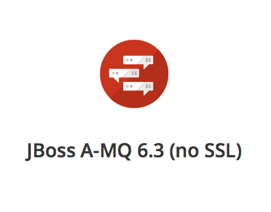
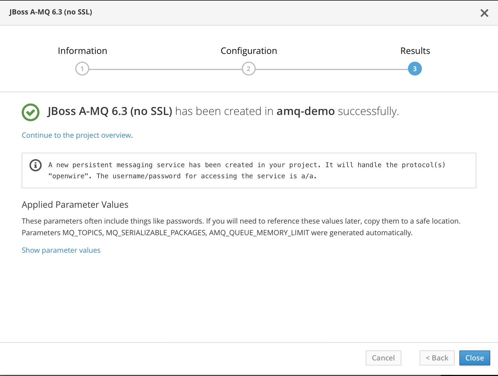

# Deploy to OpenShift Application Platform

Before we deploy the application to OpenShift we need to add health checks so that OpenShift can correctly detect if our application is working. For this simple application we will simply leverage another Spring Boot project: Spring Actuator.

**1. Add a health check**

Spring Boot provides a nice feature for health checks called Actuator. Actuator is a project which exposes health data under the API path `/health` that is collected during application runtime automatically. All we need to do to enable this feature is to add the following dependency to ``pom.xml``{{open}} at the **TODO** comment..

<pre class="file" data-filename="pom.xml" data-target="insert" data-marker="<!-- TODO: Add Actuator dependency here -->">
    &lt;dependency&gt;
      &lt;groupId&gt;org.springframework.boot&lt;/groupId&gt;
      &lt;artifactId&gt;spring-boot-starter-actuator&lt;/artifactId&gt;
    &lt;/dependency&gt;
</pre>

**2. Deploy a JBoss AMQ Instance**

The first thing we must do is create a template. This will allow us to generate a deployment based on some preconfigured settings.  After that we'll create a Service account for the AMQ Broker to run as. We then assign the `view` role to that account FOR SOME REASON and then we need to add SSL keys for the connections. Then we import the certificates into OpenShift as secrets and we're done. Sounds like a lot, but the steps are very simple.

**2.1 Create Messaging Templates**

In order create our template we have to load a `json` file with all of the configuration defined. We don't have permissions to create a template with our developer credentials, so we'll quickly log into a different user to create the template.

``oc login -u system:admin``{{execute}}

After we're logged in, confirm that we're using the proper project. We should see output that says: `Using project "amq-demo"`. Since we're in the right project, let's go ahead and load up our template:

``oc create -f https://raw.githubusercontent.com/openshift/openshift-ansible/master/roles/openshift_examples/files/examples/v1.3/xpaas-templates/amq62-ssl.json -n openshift``{{execute}}

We should see `template "amq62-ssl" created` which means we're done creating our template! Log back into our developer user and we can get into the other steps necessary for deploying our JBoss Instance.

``oc login -u developer -p developer``{{execute}}

**2.2 Create Service account and SSL Keys**

Now we need to make our Service Account for the broker. In order to do that we must first create our ServiceAccount, which we're naming `amq-service-account`:

``echo '{"kind": "ServiceAccount", "apiVersion": "v1", "metadata": {"name": "amq-service-account"}}' | oc create -f -``{{execute}}

``oc create serviceaccount amq-service-account``{{execute}}

Now we simply add the view role to our newly created Service Account:

``oc policy add-role-to-user view system:serviceaccount:amq-demo:amq-service-account``{{execute}}

Now that our Service Account is created and has the role required, next we need to add SSL keys. When deploying AMQ to OpenShift we are required to provide SSL keys. If you do not have your own enterprise keys (such as for a Dev environment) you can create your own. Execute the following to create the SSL keys:

``keytool -genkey -noprompt -trustcacerts -alias broker -keyalg RSA -keystore broker.ks -keypass password -storepass password -dname "cn=Dev, ou=engineering, o=company, c=US"``{{execute}}

``keytool -export -noprompt -alias broker -keystore broker.ks -file broker_cert -storepass password``{{execute}}

``keytool -genkey -noprompt -trustcacerts -alias client -keyalg RSA -keystore client.ks -keypass password -storepass password -dname "cn=Dev, ou=engineering, o=company, c=US"``{{execute}}

``keytool -import -noprompt -trustcacerts -alias broker -keystore client.ts -file broker_cert -storepass password``{{execute}}

<!-- ``keytool -genkey -alias broker -keyalg RSA -keystore broker.ks``{{execute}}

``keytool -export -alias broker -keystore broker.ks -file broker_cert``{{execute}}

``keytool -genkey -alias client -keyalg RSA -keystore client.ks``{{execute}}

``keytool -import -alias broker -keystore client.ts -file broker_cert``{{execute}} -->
If all of the commands were ran successfully, we should see `Certificate was added to keystore` in our terminal.

Next we will import these certificates into OpenShift as secrets:

``oc secrets new amq-app-secret broker.ks``{{execute}}

``oc secrets add sa/amq-service-account secret/amq-app-secret``{{execute}}

And now all of our configuration is complete. Now it's time to create the AMQ instance.

**2.3 Create AMQ Instance**

Log into the web view and select our `amq-demo` project. Then select `Add to Project` followed by `Browse Catalog`. We should now see a new template under the `Technologies` section that says `Messaging`:

Click on that template option and we'll be presented with all of the amq templates we've created. Select `amq62-ssl` and hit `Select`:

We should now see a form accepting multiple parameters for generating the template. The only ones we have to change are the `AMQ_TRUSTSTORE_PASSWORD` and the `AMQ_KEYSTORE_PASSWORD`, both of which are required fields. When we created the SSL keys earlier we set both of these values to be `password`, so simply fill in `password` for both of those fields and then scroll down to the bottom and hit `Create`. Our application should now be created and we should be greeted with this screen:

Go to the overview and our final step is to expose the routes we require. The four we need to create are:

`amq-amqp-ssl`
`amq-mqtt-ssl`
`amq-stomp-ssl`
`amq-tcp-ssl`

For each of these routes, click the `Create Route` button and then scroll down and click `Create`. After we've created all four, our JBoss AMQ setup is finally complete!

<!-- Finally we can deploy AMQ: (TODO NOT WORKING)

oc create route passthrough --service amq63-amq-tcp-ssl && \

oc create route passthrough --service amq63-amq-stomp-ssl && \

oc create route passthrough --service amq63-amq-amqp-ssl && \

oc create route passthrough --service amq63-amq-mqtt-ssl -->

**3. Deploy the application to OpenShift**

Run the following command to deploy the application to OpenShift

``mvn package fabric8:deploy -Popenshift``{{execute}}

There's a lot that happens here so lets break it down:

The `mvn package` piece of the above command instructs Maven to run the package lifecycle. This builds a Spring Boot JAR file which is a Fat Jar containing all dependencies necessary to run our application.

For the deployment to OpenShift we are using the [Fabric8](https://fabric8.io/) tool through the `fabric8-maven-plugin` which is configured in our ``pom.xml``{{open}} (found in the `<profiles/>` section). Configuration files for Fabric8 are contained in the ``src/main/fabric8``{{open}} folder mentioned earlier.

After the Maven build as finished, it will typically take less than 20 sec for the application to be available. Then you can either go to the OpenShift web console and click on the route or click [here](http://rhoar-training-dev.[[HOST_SUBDOMAIN]]-80-[[KATACODA_HOST]].environments.katacoda.com)

You should see the same web application as before. The scheduled Producer will continue to deploy messages so clicking refresh should change the values shown every 3 seconds.

## Congratulations

You have now learned how to deploy a Spring Boot JMS application and a JBoss AMQ resource to the OpenShift Container Platform.

Click Summary for more details and suggested next steps.
