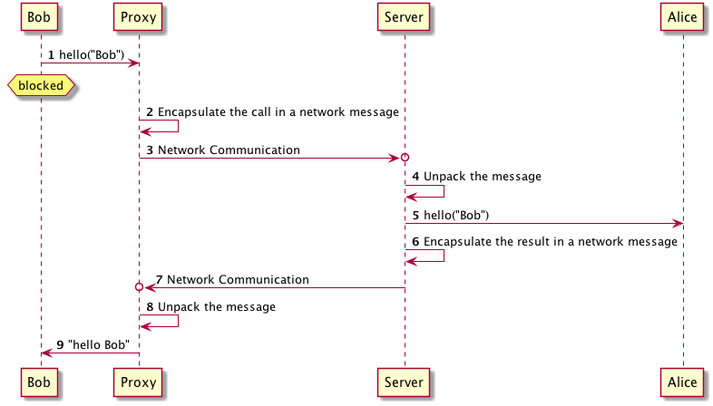
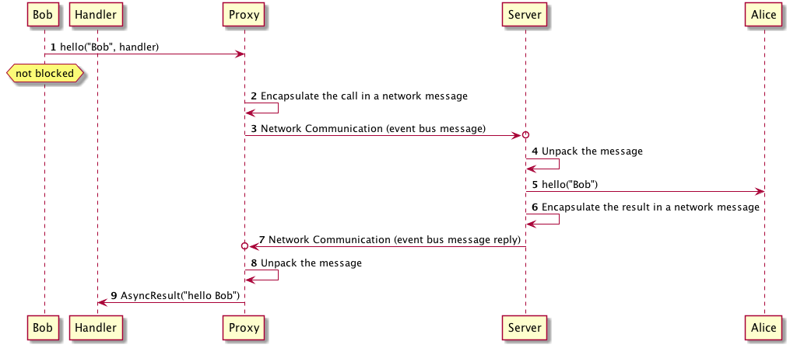

In this scenario, you will create the portfolio microservice

Microservices are not only about REST. They can be exposed using any types of interactions, and Remote Procedure Calls is one of them. With RPC, a component can effectively send a request to another component by doing a local procedure call, which results in the request being packaged in a message and sent to the callee. Likewise, the result is sent back and returned to the caller component as the result of the procedure call:

Such interactions has the advantages to introduce typing, and so is less error-prone than unstructured messages. However, it also introduces a tighter coupling between the caller and the callee. The caller knows how to call the callee:

The AsyncResult notifies the Handler whether the invocation succeeded or failed. Upon success, the handler can retrieve the result.

Such async-RPC has several advantages:

the caller is not blocked

it deals with failures

it avoids you to send messages on the event bus and manages object marshalling and unmarshalling for you.
